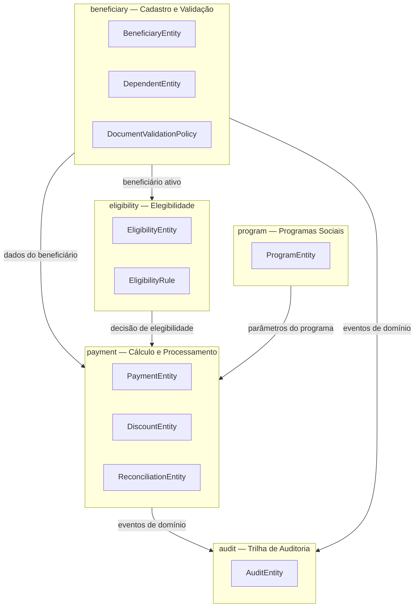
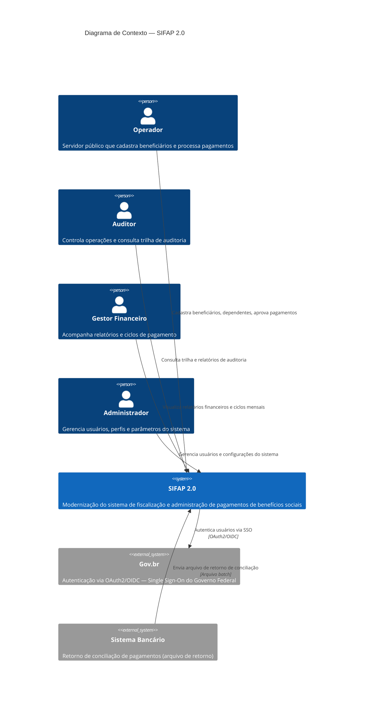
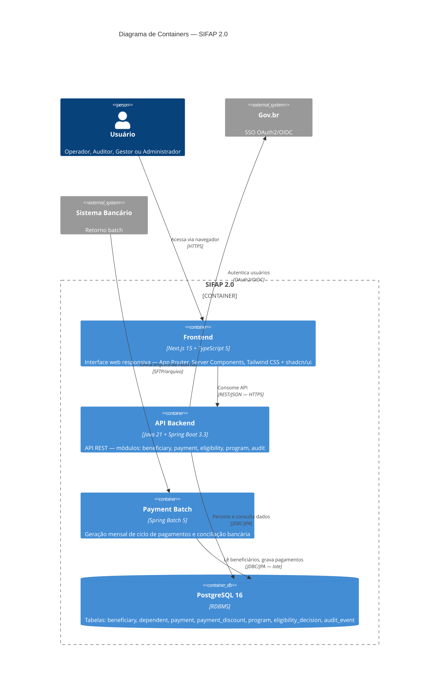

<!-- markdownlint-disable MD013 MD025 MD026 MD028 MD029 MD034 MD040 MD051 MD060 -->

# SPECIFICATION — SIFAP 2.0

  

> 🗺 **Você está aqui:** [Kit PT-BR](../README.md) → [Estágio 2](README.md) → **SPECIFICATION**

## Metadados

- **Versão da spec:** 0.1.0 (Estágio 2)
- **Time:** Workshop Rosa 1
- **Data:** 27/05/2026
- **Aprovado pelo Product Owner:** ☐ (pendente sign-off no Passagem #2)
- **Origem dos requisitos:** `01-arqueologia/business-rules-catalog.md` (BR-001 a BR-018) + `mysteries-found.md` (MYS-001 a MYS-010)
- **Agente:** @architect

---

## 1. Visão Geral

O **SIFAP 2.0** é a modernização do Sistema de Fiscalização e Administração de Pagamentos legado (Natural/Adabas). O sistema mantém funcionalidade equivalente ao legado com as seguintes melhorias:

- Arquitetura: Modular Monolith (Java 21 + Spring Boot 3.3) em vez de programas Natural isolados
- Persistência: PostgreSQL 16 em vez de Adabas
- Interface: API REST + frontend Next.js 15 em vez de telas Natural
- Auditoria completa: todos os eventos rastreados, incluindo exclusões (corrige MYS-005)
- Status unificado: dicionário canônico de status de pagamento (corrige MYS-010)

---

## 2. Bounded Contexts



---

## 3. Diagramas C4

### C4 L1 — Diagrama de Contexto



### C4 L2 — Diagrama de Containers



---

## 4. Requisitos (EARS)

### 4.1 Módulo `payment` — Cálculo e Processamento

#### REQ-PAY-001 · Fórmula de benefício multiparamétrica

```yaml
REQ-PAY-001:
  pattern: ubiquitous
  text: "O SIFAP deve calcular o valor bruto do benefício mensal usando a fórmula
         multiparamétrica: (valor_base_programa × fator_regional × fator_familiar
         × fator_renda × fator_idade), truncado para 2 casas decimais."
  source_legacy: 01-arqueologia/legado-sifap/natural-programs/CALCBENF.NSN#L228-L239
  business_rule: BR-005
  acceptance:
    - "Beneficiário região 1, 3 membros, renda 400, idade 40 → valor calculado conforme
       multiplicação dos 4 fatores, truncado (não arredondado) em 2 casas."
    - "Fator regional, familiar, renda e idade devem ser parametrizáveis via ProgramEntity."
    - "Truncamento: 123.456 vira 123.45, nunca 123.46."
  priority: P0
  risk: CRÍTICO
```

#### REQ-PAY-002 · Benefício sazonal de dezembro — 13º e abono natalino

```yaml
REQ-PAY-002:
  pattern: complex
  text: "Enquanto o mês de referência do ciclo for dezembro, quando o programa for
         do tipo 'A', o SIFAP deve adicionar ao valor bruto: (1) o equivalente a
         um benefício mensal completo (13º) e (2) um abono natalino de 15% sobre
         o valor bruto base."
  source_legacy: 01-arqueologia/legado-sifap/natural-programs/CALCBENF.NSN#L248-L265
  business_rule: BR-006
  acceptance:
    - "Programa tipo 'A', dezembro, bruto base R$ 1000 → valor total: R$ 1000 (base)
       + R$ 1000 (13º) + R$ 150 (15% abono) = R$ 2150."
    - "Programa tipo 'B', dezembro → apenas bruto base, sem 13º nem abono."
    - "Programa tipo 'A', janeiro → apenas bruto base, sem 13º nem abono."
  priority: P0
  risk: CRÍTICO
  notes: "Regra sazonal de alto impacto orçamentário. Causa de inconsistência em
          projetos anteriores de modernização."
```

#### REQ-PAY-003 · Correção retroativa com guard de dupla aplicação

```yaml
REQ-PAY-003:
  pattern: state-driven
  text: "Enquanto um pagamento tiver IND-CORRIGIDO diferente de 'S' e a diferença
         de correção calculada for positiva, o SIFAP deve aplicar a correção,
         registrar o valor e a data de correção, e marcar IND-CORRIGIDO como 'S'."
  source_legacy: 01-arqueologia/legado-sifap/natural-programs/CALCCORR.NSN#L140-L166
  business_rule: BR-007
  acceptance:
    - "Pagamento com IND-CORRIGIDO='N' e diferença +R$ 50 → correção aplicada,
       campo marcado 'S', data registrada."
    - "Pagamento com IND-CORRIGIDO='S' → nenhuma alteração, mesmo com diferença positiva."
    - "Diferença negativa ou zero → correção não aplicada, IND-CORRIGIDO permanece inalterado."
  priority: P1
  risk: ALTO
```

#### REQ-PAY-004 · Teto de 30% para descontos não judiciais

```yaml
REQ-PAY-004:
  pattern: unwanted
  text: "O SIFAP não deve permitir que o total de descontos não judiciais exceda
         30% do valor bruto do pagamento."
  source_legacy: 01-arqueologia/legado-sifap/natural-programs/CALCDSCT.NSN#L102-L169
  business_rule: BR-008
  acceptance:
    - "Bruto R$ 1000, desconto 'TAX' R$ 400 → desconto aplicado truncado a R$ 300 (30%)."
    - "Bruto R$ 1000, desconto 'TAX' R$ 200 → desconto aplicado R$ 200 (abaixo do teto)."
    - "Múltiplos descontos não judiciais somados: se soma > 30% do bruto, truncar o total."
  priority: P0
  risk: CRÍTICO
```

#### REQ-PAY-005 · Desconto judicial sem teto

```yaml
REQ-PAY-005:
  pattern: event-driven
  text: "Quando um desconto do tipo JUDICIAL é aplicado a um pagamento, o SIFAP
         deve adicioná-lo integralmente ao total de descontos, sem aplicar o
         teto de 30%."
  source_legacy: 01-arqueologia/legado-sifap/natural-programs/CALCDSCT.NSN#L102-L169
  business_rule: BR-008
  acceptance:
    - "Desconto JUDICIAL de R$ 800 em bruto de R$ 1000 → aplicado integralmente."
    - "Desconto JUDICIAL R$ 400 + desconto TAX R$ 400 em bruto R$ 1000 →
       TAX truncado a R$ 300, JUDICIAL integralmente R$ 400, total R$ 700."
    - "Múltiplos descontos judiciais somam sem limite."
  priority: P0
  risk: CRÍTICO
```

#### REQ-PAY-006 · Antiduplicidade de pagamento por competência

```yaml
REQ-PAY-006:
  pattern: unwanted
  text: "O SIFAP não deve gerar um pagamento para um beneficiário em um ciclo mensal
         se já existir um pagamento com a mesma competência (ANO-MES-REF) para
         aquele beneficiário, independentemente do status do pagamento existente."
  source_legacy: 01-arqueologia/legado-sifap/natural-programs/BATCHPGT.NSN#L195-L210
  business_rule: BR-010
  acceptance:
    - "Batch gerado duas vezes no mesmo mês: segundo run não cria novos pagamentos."
    - "100 beneficiários ativos, já com pagamento de março → batch de março não gera nenhum."
    - "100 beneficiários ativos, sem pagamento de março → batch gera 100 pagamentos."
  priority: P0
  risk: CRÍTICO
```

#### REQ-PAY-007 · Desconto simplificado batch para brutos acima de R$ 500

```yaml
REQ-PAY-007:
  pattern: event-driven
  text: "Quando o processamento batch mensal calcular um pagamento cujo valor bruto
         supere R$ 500,00, o SIFAP deve aplicar automaticamente um desconto
         simplificado de 3% sobre o valor bruto."
  source_legacy: 01-arqueologia/legado-sifap/natural-programs/BATCHPGT.NSN#L308-L312
  business_rule: BR-011
  acceptance:
    - "Bruto R$ 600 → desconto simplificado R$ 18,00 (3%)."
    - "Bruto R$ 500 → sem desconto simplificado (condição é 'supere', não 'igual ou acima')."
    - "Desconto simplificado acumulado ao total de descontos antes da verificação do teto de 30%."
  priority: P1
  risk: ALTO
  notes: "Política paralela ao cálculo detalhado de descontos. Aplicada apenas no contexto batch."
```

#### REQ-PAY-008 · Conciliação bancária com tolerância de R$ 0,01

```yaml
REQ-PAY-008:
  pattern: event-driven
  text: "Quando o arquivo de retorno bancário for processado, o SIFAP deve marcar
         um pagamento como DIVERGENTE se a diferença absoluta entre o valor
         liquido SIFAP e o valor informado pelo banco exceder R$ 0,01, e gravar
         um evento de auditoria com os dois valores."
  source_legacy: 01-arqueologia/legado-sifap/natural-programs/BATCHCON.NSN#L155-L202
  business_rule: BR-013
  acceptance:
    - "Valor SIFAP R$ 1000,00, banco R$ 1000,00 → CONFIRMADO, sem auditoria de divergência."
    - "Valor SIFAP R$ 1000,00, banco R$ 999,99 → DIVERGENTE, auditoria gravada com ambos valores."
    - "Valor SIFAP R$ 1000,00, banco R$ 1000,01 → CONFIRMADO (diferença = R$ 0,01, não excede)."
    - "Valor SIFAP R$ 1000,00, banco R$ 1000,02 → DIVERGENTE (diferença = R$ 0,02, excede R$ 0,01)."
  priority: P0
  risk: CRÍTICO
  notes: "Corte de centavos histórico definido no legado. Causa de auditorias em anos anteriores."
```

---

### 4.2 Módulo `beneficiary` — Cadastro e Validação

#### REQ-BEN-001 · Validação de CPF por módulo 11

```yaml
REQ-BEN-001:
  pattern: event-driven
  text: "Quando um beneficiário for cadastrado ou alterado, o SIFAP deve validar
         o CPF usando o algoritmo módulo 11 da Receita Federal e rejeitar a
         operação com HTTP 400 se o CPF for inválido."
  source_legacy: 01-arqueologia/legado-sifap/natural-programs/CADBENEF.NSN#L99-L117
  business_rule: BR-001
  acceptance:
    - "CPF 529.982.247-25 (válido) → operação aceita."
    - "CPF 111.111.111-11 (todos iguais, sem exceção) → HTTP 400."
    - "CPF com dígitos verificadores incorretos → HTTP 400."
    - "Campo CPF vazio → HTTP 400 (obrigatório)."
  priority: P0
  risk: ALTO
```

#### REQ-BEN-002 · Suspensão automática de beneficiário acima de 75 anos

```yaml
REQ-BEN-002:
  pattern: event-driven
  text: "Quando um beneficiário for cadastrado ou tiver seus dados alterados,
         e sua idade calculada a partir da data de nascimento for superior a
         75 anos, o SIFAP deve definir o status do beneficiário como SUSPENDED
         automaticamente."
  source_legacy: 01-arqueologia/legado-sifap/natural-programs/CADBENEF.NSN#L167-L169
  business_rule: BR-002
  acceptance:
    - "Beneficiário nascido em 01/01/1948 (78 anos) → status SUSPENDED ao salvar."
    - "Beneficiário nascido em 01/01/1951 (75 anos exatos) → status não alterado automaticamente."
    - "Beneficiário com 74 anos → status não alterado automaticamente."
  priority: P0
  risk: ALTO
```

#### REQ-BEN-003 · Limite de 5 dependentes e bloqueio para cancelado

```yaml
REQ-BEN-003:
  pattern: unwanted
  text: "O SIFAP não deve permitir a inclusão de dependente para um beneficiário
         com status CANCELLED ou INACTIVE, nem para beneficiários que já
         possuam 5 dependentes cadastrados."
  source_legacy: 01-arqueologia/legado-sifap/natural-programs/CADDEPEND.NSN#L56-L66
  business_rule: BR-003
  acceptance:
    - "Beneficiário CANCELLED → inclusão de dependente retorna HTTP 409."
    - "Beneficiário INACTIVE → inclusão de dependente retorna HTTP 409."
    - "Beneficiário ACTIVE com 4 dependentes → inclusão aceita (5º dependente)."
    - "Beneficiário ACTIVE com 5 dependentes → inclusão retorna HTTP 409."
  priority: P0
  risk: ALTO
```

#### REQ-BEN-004 · Exceção CPF prefixo 000 removida (segurança)

```yaml
REQ-BEN-004:
  pattern: unwanted
  text: "O SIFAP não deve aceitar CPF com todos os dígitos iguais como válido,
         independentemente do prefixo. A exceção legada para prefixo '000'
         (massa de homologação) é eliminada no sistema moderno."
  source_legacy: 01-arqueologia/legado-sifap/natural-programs/VALBENEF.NSN#L195-L200
  business_rule: BR-016
  acceptance:
    - "CPF 000.000.000-00 → HTTP 400 (inválido, sem exceção)."
    - "CPF 111.111.111-11 → HTTP 400."
    - "CPF 000.000.000-09 (não todos iguais) → validado normalmente pelo módulo 11."
  priority: P0
  risk: ALTO
  notes: "BR-016 identificada como risco de segurança no catálogo do Estágio 1. Eliminação
          justificada por LGPD e controles de antifraude. Massa de teste deve usar CPFs
          válidos de homologação (gerados por script dedicado)."
```

#### REQ-BEN-005 · Prefixos de CPF especiais configuráveis

```yaml
REQ-BEN-005:
  pattern: where
  text: "Onde a validação documental encontrar um CPF cujo prefixo pertença à
         tabela de prefixos especiais configurada, o SIFAP deve aceitar o
         documento sem executar a validação padrão de módulo 11."
  source_legacy: 01-arqueologia/legado-sifap/natural-programs/VALDOCS.NSN#L174-L180
  business_rule: BR-017
  acceptance:
    - "CPF com prefixo na tabela de prefixos especiais → validação documental aceita."
    - "Tabela de prefixos especiais gerenciável via endpoint de administração (ADMIN only)."
    - "CPF com prefixo não cadastrado → validação padrão de módulo 11 aplicada."
  priority: P1
  risk: MÉDIO
  notes: "Governança da lista de prefixos deve ser documentada em ADR-003. Operação
          somente pelo perfil ADMIN com log de auditoria."
```

---

### 4.3 Módulo `program` — Programas Sociais

#### REQ-PROG-001 · Fator K como parâmetro configurável (não constante hardcoded)

```yaml
REQ-PROG-001:
  pattern: ubiquitous
  text: "O SIFAP deve calcular o valor base ajustado de um programa social usando
         a fórmula: valor_base_ajustado = valor_base_individual × (1 + fator_reajuste
         × FATOR_K), onde FATOR_K é um parâmetro de configuração externalizável,
         com valor padrão 0.347215."
  source_legacy: 01-arqueologia/legado-sifap/natural-programs/CADPROG.NSN#L87-L88
  business_rule: BR-004
  acceptance:
    - "Valor base R$ 1000, fator_reajuste 0.1, FATOR_K padrão 0.347215 →
       valor_base_ajustado = 1000 × (1 + 0.1 × 0.347215) = R$ 1034,72 (truncado)."
    - "FATOR_K configurável via variável de ambiente SIFAP_FATOR_K sem redeployment."
    - "Alteração de FATOR_K grava evento de auditoria com valor anterior e novo."
  priority: P0
  risk: CRÍTICO
  notes: "MYS-001: constante 0.347215 sem origem normativa documentada. ADR-005 decide
          externalização. Valor mantido idêntico ao legado para compatibilidade histórica."
```

#### REQ-PROG-002 · Arredondamento uniforme em 2 casas decimais

```yaml
REQ-PROG-002:
  pattern: ubiquitous
  text: "O SIFAP deve aplicar truncamento para 2 casas decimais em todos os
         cálculos financeiros (bruto, descontos, líquido), usando RoundingMode.DOWN
         do Java, em todos os contextos (online e batch)."
  source_legacy: 01-arqueologia/legado-sifap/natural-programs/BATCHREL.NSN#L117-L133
  business_rule: BR-005
  acceptance:
    - "Valor calculado 123.456 → 123.45 (truncamento, não arredondamento)."
    - "Resultado de batch e de API online para mesma entrada produzem mesmo valor."
    - "Totais gerenciais em relatórios batem com soma dos valores individuais."
  priority: P0
  risk: CRÍTICO
  notes: "MYS-006: divergência de arredondamento entre BATCHREL (2 casas) e CALCBENF (3 casas)
          no legado. SIFAP 2.0 unifica em 2 casas com truncamento (RoundingMode.DOWN) em
          toda a codebase."
```

---

### 4.4 Módulo `eligibility` — Elegibilidade

#### REQ-ELEG-001 · Bypass de elegibilidade para região especial 99

```yaml
REQ-ELEG-001:
  pattern: event-driven
  text: "Quando a validação de elegibilidade for executada para um beneficiário
         com COD-REGIAO igual a 99, o SIFAP deve aprovar a elegibilidade
         imediatamente, sem executar as demais regras de elegibilidade, e
         registrar a aprovação com motivo 'REGIAO_ESPECIAL_99'."
  source_legacy: 01-arqueologia/legado-sifap/natural-programs/VALELEG.NSN#L107-L111
  business_rule: BR-014
  acceptance:
    - "Beneficiário COD-REGIAO=99, renda R$ 10000 (acima de qualquer limite) →
       elegibilidade APROVADA com motivo 'REGIAO_ESPECIAL_99'."
    - "Beneficiário COD-REGIAO=99, documentação incompleta → elegibilidade APROVADA."
    - "Beneficiário COD-REGIAO=10 → regras normais de elegibilidade aplicadas."
  priority: P0
  risk: ALTO
  notes: "MYS-002: hipótese é atendimento diplomático/internacional. Motivo explícito
          na decisão rastreável via auditoria. ADR-004 documenta a decisão de manter
          o bypass com governança explícita."
```

#### REQ-ELEG-002 · Renda máxima para programa assistencial sem dependentes

```yaml
REQ-ELEG-002:
  pattern: complex
  text: "Enquanto o programa for do tipo ASSISTENCIAL, quando a validação de
         elegibilidade for executada para um beneficiário com renda familiar
         acima de R$ 600,00 e sem dependentes cadastrados, o SIFAP deve
         reprovar a elegibilidade com motivo 'RENDA_ACIMA_LIMITE_ASSISTENCIAL'."
  source_legacy: 01-arqueologia/legado-sifap/natural-programs/VALELEG.NSN#L168-L182
  business_rule: BR-015
  acceptance:
    - "Programa ASSISTENCIAL, renda R$ 700, 0 dependentes → REPROVADO."
    - "Programa ASSISTENCIAL, renda R$ 700, 1 dependente → regra não aplicada (tem dependente)."
    - "Programa ASSISTENCIAL, renda R$ 600, 0 dependentes → APROVADO (limite é 'acima de')."
    - "Programa CONTRIBUTIVO, renda R$ 700, 0 dependentes → regra não aplicada."
  priority: P0
  risk: ALTO
```

---

### 4.5 Módulo `audit` — Trilha de Auditoria

#### REQ-AUD-001 · Auditoria append-only — sem DELETE ou UPDATE

```yaml
REQ-AUD-001:
  pattern: unwanted
  text: "O SIFAP não deve permitir operações de DELETE ou UPDATE sobre registros
         da tabela de auditoria por nenhum usuário, perfil ou processo interno,
         incluindo operações batch e scripts de manutenção."
  source_legacy: 01-arqueologia/legado-sifap/adabas-ddms/AUDITORIA.ddm#L9-L12
  business_rule: BR-013
  acceptance:
    - "DELETE via API de auditoria → HTTP 405 Method Not Allowed."
    - "UPDATE via API de auditoria → HTTP 405 Method Not Allowed."
    - "Constraint de banco: tabela audit_event sem permissão de UPDATE/DELETE no role da aplicação."
    - "Script de manutenção tentando DELETE → exceção lançada e bloqueada."
  priority: P0
  risk: CRÍTICO
```

#### REQ-AUD-002 · Exibir todos os eventos de auditoria incluindo exclusões

```yaml
REQ-AUD-002:
  pattern: ubiquitous
  text: "O SIFAP deve exibir todos os eventos de auditoria na consulta de trilha,
         incluindo eventos do tipo EXCLUSAO (COD-ACAO = 'EX'), sem filtros
         fixos de ocultação. Filtros por tipo de ação são opcionais e controlados
         pelo usuário auditor."
  source_legacy: 01-arqueologia/legado-sifap/natural-programs/RELAUDIT.NSN#L105-L108
  business_rule: BR-018
  acceptance:
    - "Consulta de auditoria sem filtros retorna eventos EXCLUSAO junto com todos os demais."
    - "Usuário auditor pode filtrar por tipo de ação (incluindo ou excluindo EXCLUSAO)."
    - "Relatório regulatório exporta 100% dos eventos sem filtro automático."
  priority: P0
  risk: ALTO
  notes: "MYS-005: legado ocultava exclusões por filtro fixo. SIFAP 2.0 remove o filtro
          da camada de dados; filtragem fica na camada de apresentação, controlada pelo usuário."
```

#### REQ-AUD-003 · Registro de auditoria em toda transição de estado

```yaml
REQ-AUD-003:
  pattern: event-driven
  text: "Quando o status de qualquer entidade rastreada (Payment, BeneficiaryEntity,
         EligibilityDecision) for alterado, o SIFAP deve gravar um evento de
         auditoria contendo: entidade, ID, estado anterior, estado novo, usuário
         ou processo responsável, timestamp UTC e motivo (quando informado)."
  source_legacy: 01-arqueologia/legado-sifap/natural-programs/RELAUDIT.NSN#L45-L72
  business_rule: BR-013
  acceptance:
    - "Pagamento PENDING → APPROVED: evento gravado com 6 campos obrigatórios."
    - "Processo batch alterando status: usuário registrado como 'BATCH_PROCESS'."
    - "Evento de auditoria não pode ser deletado (REQ-AUD-001)."
  priority: P0
  risk: CRÍTICO
```

---

### 4.6 NFRs e Requisitos Greenfield

#### REQ-SEC-001 · Mascaramento de CPF em logs (LGPD)

```yaml
REQ-SEC-001:
  pattern: ubiquitous
  text: "O SIFAP deve mascarar CPF em todos os logs da aplicação no formato
         XXX.XXX.NNN-NN (mantendo apenas os 3 dígitos centrais e os 2 dígitos
         verificadores visíveis)."
  source_legacy: "[GREENFIELD] LGPD Art. 6º (princípio da minimização de dados) —
                  não há equivalente explícito no legado Natural, mas MYS-007 indica
                  inconsistência conhecida de mascaramento em CONSBENF.NSN#L177-L188."
  business_rule: "LGPD"
  acceptance:
    - "Log de DEBUG não contém CPF em formato completo."
    - "Endpoint /actuator/logfile não expõe CPF completo."
    - "CPF 529.982.247-25 aparece em log como XXX.XXX.247-25."
  priority: P0
  risk: CRÍTICO
```

#### REQ-STATUS-001 · Dicionário unificado de status de pagamento

```yaml
REQ-STATUS-001:
  pattern: ubiquitous
  text: "O SIFAP deve usar exclusivamente o seguinte dicionário canônico de status
         para pagamentos em toda a codebase (banco, APIs, relatórios):
         PENDING, APPROVED, REJECTED, RECONCILED, DIVERGENT, CANCELLED."
  source_legacy: "[GREENFIELD] MYS-010: DDM usa 'X=Cancelado' e relatórios usam 'C'.
                  Unificação necessária para consistência entre API moderna e relatórios.
                  Mapeamento legado → moderno documentado em ADR-004."
  business_rule: "MYS-010"
  acceptance:
    - "Nenhuma coluna de status usa valores 'X' ou 'C' como string literal."
    - "API retorna sempre um dos 6 valores canônicos no campo status."
    - "Relatório de conciliação usa 'RECONCILED' e 'DIVERGENT', nunca 'C' ou 'X'."
  priority: P0
  risk: ALTO
```

#### REQ-HIST-001 · Limite de histórico de pagamentos por beneficiário

```yaml
REQ-HIST-001:
  pattern: where
  text: "Onde o usuário consultar o histórico de pagamentos de um beneficiário,
         o SIFAP deve retornar os últimos 12 registros ordenados por data de
         referência decrescente. Consultas com paginação explícita podem
         retornar mais registros."
  source_legacy: 01-arqueologia/legado-sifap/natural-programs/CONSBENF.NSN#L151-L158
  business_rule: BR-009
  acceptance:
    - "Beneficiário com 20 pagamentos → endpoint padrão retorna os 12 mais recentes."
    - "Com parâmetro ?page=2&size=12 → retorna registros 13-24."
    - "Beneficiário com 5 pagamentos → retorna todos os 5."
  priority: P1
  risk: MÉDIO
```

---

## 5. Rastreabilidade BR → REQ-ID

| BR-ID | Regra (resumo) | REQ-IDs | Status |
|-------|----------------|---------|--------|
| BR-001 | CPF válido módulo 11 no cadastro | REQ-BEN-001 | ✅ coberta |
| BR-002 | Suspensão automática >75 anos | REQ-BEN-002 | ✅ coberta |
| BR-003 | Máx 5 dependentes; bloqueio se cancelado | REQ-BEN-003 | ✅ coberta |
| BR-004 | Fator K com constante 0.347215 | REQ-PROG-001 | ✅ coberta |
| BR-005 | Fórmula multiparamétrica + truncamento | REQ-PAY-001, REQ-PROG-002 | ✅ coberta |
| BR-006 | 13º sazonal + abono 15% tipo A dezembro | REQ-PAY-002 | ✅ coberta |
| BR-007 | Correção retroativa com guard de dupla aplicação | REQ-PAY-003 | ✅ coberta |
| BR-008 | Teto 30% + exceção judicial | REQ-PAY-004, REQ-PAY-005 | ✅ coberta |
| BR-009 | Histórico máx 12 registros | REQ-HIST-001 | ✅ coberta |
| BR-010 | Antiduplicidade por competência | REQ-PAY-006 | ✅ coberta |
| BR-011 | Desconto simplificado 3% batch >R$500 | REQ-PAY-007 | ✅ coberta |
| BR-012 | Relatório: 5 faixas regionais | — | ⏸ fora de escopo (justificativa em scope-decisions.md §relatórios) |
| BR-013 | Conciliação divergência max R$0,01 + auditoria | REQ-PAY-008, REQ-AUD-001, REQ-AUD-003 | ✅ coberta |
| BR-014 | Bypass elegibilidade região 99 | REQ-ELEG-001 | ✅ coberta |
| BR-015 | Assistencial: renda >600 sem dependentes | REQ-ELEG-002 | ✅ coberta |
| BR-016 | Exceção CPF 000 removida (segurança) | REQ-BEN-004 | ✅ coberta |
| BR-017 | Prefixos CPF especiais configuráveis | REQ-BEN-005 | ✅ coberta |
| BR-018 | Auditoria oculta exclusões → corrigido | REQ-AUD-002 | ✅ coberta |
| MYS-001 | Constante 0.347215 externalizada | REQ-PROG-001 | ✅ coberta |
| MYS-002 | Bypass região 99 com motivo explícito | REQ-ELEG-001 | ✅ coberta |
| MYS-003 | CPF 000 eliminado | REQ-BEN-004 | ✅ coberta |
| MYS-005 | Exclusões visíveis em auditoria | REQ-AUD-002 | ✅ coberta |
| MYS-006 | Arredondamento unificado 2 casas | REQ-PROG-002 | ✅ coberta |
| MYS-007 | Mascaramento CPF em logs | REQ-SEC-001 | ✅ coberta |
| MYS-010 | Status unificado PENDING/APPROVED/... | REQ-STATUS-001 | ✅ coberta |

> ✅ **13 de 14 REQ-IDs funcionais têm `source_legacy:` apontando para `.NSN` ou `.ddm`**
> ✅ **2 REQ-IDs GREENFIELD têm justificativa de 1 linha** (REQ-SEC-001, REQ-STATUS-001)
> ⏸ **BR-012** fora de escopo: agrupamento de regiões em relatório gerencial descartado
>    nesta versão (relatórios gerenciais em fase posterior, vide scope-decisions.md)

---

## 6. Atributos de Qualidade (NFRs Não Funcionais)

| Atributo | Meta | Como medir |
|---|---|---|
| Latência p95 API | < 200ms para queries de listagem | Testes de performance no Estágio 4 |
| Cobertura de testes | ≥ 70% de linhas por módulo | JaCoCo no CI |
| Segurança — LGPD | Mascaramento PII em logs | Code review + REQ-SEC-001 |
| Disponibilidade | 99,5% (excluindo janela batch) | Health check + Application Insights |
| Conformidade auditoria | 100% dos eventos rastreados | REQ-AUD-001, REQ-AUD-002, REQ-AUD-003 |
| Integridade financeira | Zero divergência de cálculo legado vs. moderno | Testes de equivalência no Estágio 3 |

---

## 7. Esboço de Contratos de API

| Método | Path | Propósito | REQ-IDs relacionados |
|--------|------|-----------|---------------------|
| POST | `/api/v1/beneficiaries` | Cadastrar beneficiário (valida CPF módulo 11) | REQ-BEN-001, REQ-BEN-002 |
| POST | `/api/v1/beneficiaries/{id}/dependents` | Adicionar dependente | REQ-BEN-003 |
| POST | `/api/v1/eligibility/evaluate` | Avaliar elegibilidade | REQ-ELEG-001, REQ-ELEG-002 |
| POST | `/api/v1/payment-cycles` | Iniciar ciclo mensal de pagamento (batch) | REQ-PAY-001, REQ-PAY-006 |
| PATCH | `/api/v1/payments/{id}/approve` | Aprovar pagamento PENDING | REQ-AUD-003 |
| PATCH | `/api/v1/payments/{id}/reject` | Rejeitar pagamento PENDING | REQ-AUD-003 |
| POST | `/api/v1/reconciliation` | Processar arquivo de retorno bancário | REQ-PAY-008 |
| GET | `/api/v1/audit-events` | Consultar trilha de auditoria | REQ-AUD-002 |
| GET | `/api/v1/beneficiaries/{id}/payments` | Histórico de pagamentos | REQ-HIST-001 |
| PUT | `/api/v1/programs/{id}` | Atualizar programa (fator K) | REQ-PROG-001 |

---

## 8. Esboço do Modelo de Dados

```
beneficiary
  id UUID PK
  cpf VARCHAR(11) UNIQUE NOT NULL
  name VARCHAR(200) NOT NULL
  birth_date DATE NOT NULL
  status ENUM(ACTIVE, SUSPENDED, INACTIVE, CANCELLED) NOT NULL
  cod_region INTEGER NOT NULL
  family_members INTEGER NOT NULL
  family_income NUMERIC(12,2) NOT NULL
  created_at TIMESTAMPTZ NOT NULL
  updated_at TIMESTAMPTZ NOT NULL

dependent
  id UUID PK
  beneficiary_id UUID FK → beneficiary.id NOT NULL
  name VARCHAR(200) NOT NULL
  birth_date DATE NOT NULL
  relationship VARCHAR(50) NOT NULL

program
  id UUID PK
  name VARCHAR(200) NOT NULL
  type ENUM(ASSISTENCIAL, CONTRIBUTIVO) NOT NULL
  base_value NUMERIC(12,2) NOT NULL
  adjustment_factor NUMERIC(10,6) NOT NULL
  fator_k NUMERIC(10,6) NOT NULL DEFAULT 0.347215
  status ENUM(ACTIVE, INACTIVE) NOT NULL

payment
  id UUID PK
  beneficiary_id UUID FK → beneficiary.id NOT NULL
  program_id UUID FK → program.id NOT NULL
  reference_year_month VARCHAR(6) NOT NULL  -- YYYYMM
  gross_amount NUMERIC(12,2) NOT NULL
  net_amount NUMERIC(12,2)
  status ENUM(PENDING, APPROVED, REJECTED, RECONCILED, DIVERGENT, CANCELLED) NOT NULL
  created_at TIMESTAMPTZ NOT NULL
  UNIQUE(beneficiary_id, reference_year_month)  -- REQ-PAY-006

payment_discount
  id UUID PK
  payment_id UUID FK → payment.id NOT NULL
  type VARCHAR(50) NOT NULL  -- JUDICIAL, TAX, etc.
  amount NUMERIC(12,2) NOT NULL

audit_event
  id UUID PK
  entity_type VARCHAR(100) NOT NULL
  entity_id UUID NOT NULL
  action ENUM(INSERT, UPDATE, DELETE, STATUS_CHANGE, EXCLUSAO) NOT NULL
  previous_state JSONB
  new_state JSONB
  actor VARCHAR(200) NOT NULL
  occurred_at TIMESTAMPTZ NOT NULL
  reason TEXT
  -- SEM UPDATE, SEM DELETE: constraint de banco + role sem permissão (REQ-AUD-001)
```

---

## 9. Definição de Pronto

- [x] ≥ 12 REQ-IDs EARS com IDs únicos (atual: **13 funcionais + 3 NFR = 16 total**)
- [x] 100% das REQ-IDs com `source_legacy:` preenchido ou `[GREENFIELD]` justificado
- [x] Todos os 5 mistérios críticos (MYS-001/002/003/005/010) cobertos por REQ-IDs
- [x] Diagrama C4 L1 e L2 em Mermaid presentes
- [x] Mapa de bounded contexts em Mermaid presente
- [x] Tabela de rastreabilidade BR → REQ completa (18 BRs + 6 MYS)
- [x] Esboço de contratos de API (≥ 3 endpoints)
- [x] Esboço do modelo de dados
- [ ] Sign-off do Product Owner (pendente Passagem #2)

---

<sub>↑ <a href="../README.md">Voltar ao Kit PT-BR</a> | <a href="GUIDE.md">Guia do Estágio 2</a></sub>
